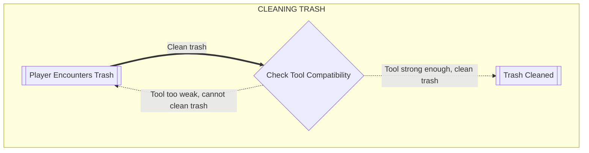
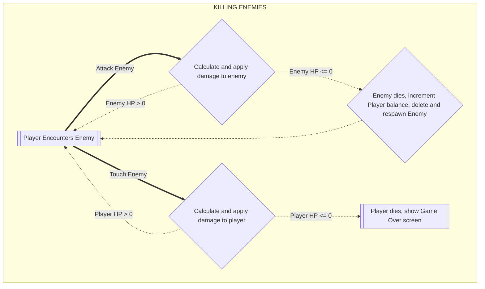
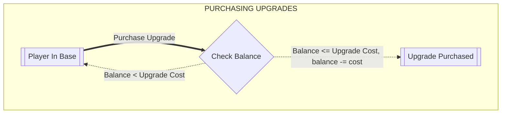

# Flows of Interaction

## Cleaning trash

```mermaid
flowchart
  subgraph CLEANING TRASH
    PlayerEncountersTrash[[Player Encounters Trash]]
    CheckTool{Check Tool Compatibility}
    PlayerCleansTrash[[Trash Cleaned]]

    PlayerEncountersTrash == Clean trash ==> CheckTool

    CheckTool -.  Tool too weak, cannot clean trash .-> PlayerEncountersTrash
    CheckTool -.  Tool strong enough, clean trash .-> PlayerCleansTrash
  end
```

## Killing enemies

```mermaid
flowchart
  subgraph KILLING ENEMIES
    PlayerEncountersEnemy[[Player Encounters Enemy]]
    CalculateDamageOnEnemy{Calculate and apply damage to enemy}
    CalculateDamageOnPlayer{Calculate and apply damage to player}
    PlayerDies[[Player dies, show Game Over screen]]
    EnemyDies{Enemy dies, increment Player balance, delete and respawn Enemy}

    PlayerEncountersEnemy == Attack Enemy ==> CalculateDamageOnEnemy
    PlayerEncountersEnemy == Touch Enemy ==> CalculateDamageOnPlayer

    CalculateDamageOnEnemy -. Enemy HP > 0 .-> PlayerEncountersEnemy
    CalculateDamageOnEnemy -. Enemy HP <= 0 .-> EnemyDies

    CalculateDamageOnPlayer -. Player HP > 0 .-> PlayerEncountersEnemy
    CalculateDamageOnPlayer -. Player HP <= 0 .-> PlayerDies

    EnemyDies -..-> PlayerEncountersEnemy

  end
```

## Purchasing upgrades

```mermaid
flowchart
  subgraph PURCHASING UPGRADES
    PlayerInBase[[Player In Base]]
    CheckBalance{Check Balance}
    UpgradeApplied[[Upgrade Purchased]]

    PlayerInBase == Purchase Upgrade ==> CheckBalance

    CheckBalance -. Balance < Upgrade Cost .-> PlayerInBase
    CheckBalance -. Balance <= Upgrade Cost, balance -= cost .-> UpgradeApplied
  end
```

